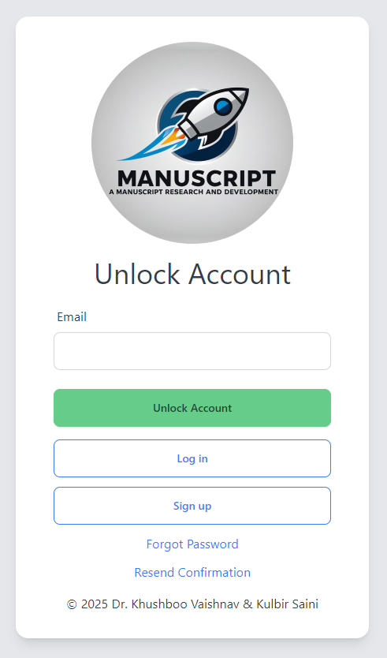

# Rails Starter Pack With User Auth and Registration Workflows

This is a Ruby on Rails 8.0.1 starter kit with [devise 4.9](https://github.com/heartcombo/devise) user registration, authentication, password recovery and other related workflows baked in. Feel free to use it. No licensing or attribution required.

- Ruby `3.3.2`
  - Can be changed in `.ruby-version` file.
- Rails `8.0.1`
- Devise `4.9`
- Database - PostgreSQL
- Mailer - SMTP via SendGrid
- TailwindCSS via [cssbundling-rails](https://github.com/rails/cssbundling-rails)
- [DaisyUI](https://daisyui.com/)

## Setup

- Copy `.env.example` file to `.env`
- Generate secrets and set values as documented in the example file
- Edit user migration file `db/migrate/20250112064150_devise_create_users.rb` if you wish to add/remove fields
- Migrate database
  - `rails db:migrate`
- Install node packages
  - `npm install`
- Run server
  - `./bin/dev`

## Features

- Separate layout for authentication workflows at `app/views/layouts/devise.html.erb`

## Screenshots

- Login Page
  
    
- Register Page
  
    
- Reset Password Page
  
    
- Account Confirmation Page
  
    
- Unlock Account Page
  
    
